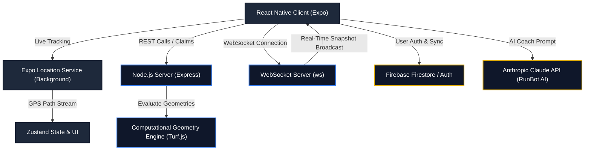

# RunQuest — Gamified Spatial Conquest Fitness Platform

[](https://www.typescriptlang.org/)
[](https://reactnative.dev/)
[](https://expo.dev/)
[](https://firebase.google.com/)
[](LICENSE)

**RunQuest** is a production-grade, gamified spatial fitness mobile application built on React Native (Expo) and backed by a real-time Node.js Express server with WebSockets. The application transforms standard running workouts into a competitive, multiplayer territory conquest game. By running closed physical loops, users claim real-world geographical boundaries, defend territories from other warriors, and expand their alliances.

Designed with high performance, scalability, and local-first reliability in mind, this project demonstrates advanced concepts in **spatial computing, computational geometry, real-time state synchronization, background OS services, and AI integrations**.

---

## 🗺️ Core Architecture & System Workflow

The architecture is split into a hybrid cloud setup using **Firebase** for persistence, authentication, and push notifications, and a dedicated **custom Express & WebSocket server** to handle real-time geospatial polygon operations and global territory mappings.



---

## ⚡ Key Technical Features

### 1. Spatial Conquest Mechanics & Geofencing (Computational Geometry)
*   **Closed-Loop Detection:** Instead of drawing simple linear paths, users must physically enclose an area. RunQuest applies an algorithm evaluating the start and end coordinates, perimeter threshold, and a circular compactness ratio.
*   **Territory Intersections:** Using a Node.js-based geospatial geometry engine fueled by **Turf.js**, when a runner claims a loop, the backend calculates the percentage overlap with existing territories. If the overlap exceeds **50%**, the target territory is captured (invaded), and the ownership chain updates instantly.
*   **Temporal Expiry System:** Captured territories are valid for **7 days**. Users must defend their territories via active geolocation verification or lose them, introducing a dynamic, self-cleaning game state.

### 2. Multi-Tiered Real-Time Synchronization
*   **WebSockets & REST:** A lightweight Node.js Express server manages client interactions. Polygons are saved locally (`data.json` database mock) and synchronized globally to all connected clients in real-time via WebSockets (`ws`), creating a live, shared spatial canvas.
*   **Offline Queueing:** Client transactions and runs are queued locally using an async-storage queue when network drops occur, ensuring complete offline capability during long-distance trail runs.

### 3. Background Services & Native Integration
*   **Background Location Tracking:** Integrates native `expo-location` and `expo-task-manager` handlers. The system records path points even when the screen is off or the application is minimized, maintaining consistent GPS polling and battery-efficient operations.
*   **Background Audio Engine:** Supports native background audio via `expo-audio` / `expo-av`. Users can import local device tracks and manage audio playback directly within the running screen, persisting track states in their accounts.
*   **Platform PDF Export Engine:** Leverages `expo-print` and `expo-sharing` to dynamically render custom HTML+SVG vectors of single runs (displaying detailed statistics, pacings, and SVG route paths) or full user profiles to shareable PDF reports.

### 4. Interactive Analytics & Animated Route Replay
*   **Geodesic Replays:** Converts logged coordinates into customized SVG layers allowing runners to visualize an animated playback of their path.
*   **Heart Rate & Aerobic Zone Calculations:** Dynamically models heart rate zone distributions (Zone 1 through Zone 5) based on real-time pacing curves, providing academic-level physiological breakdowns.

### 5. Intelligent AI Running Coach (RunBot)
*   **Natural Language Assistance:** Integrates Claude-3-Haiku via Anthropic's API to act as an on-demand coach.
*   **Local Pattern Matching Fallback:** Under a network outage or in the absence of an API key, the bot falls back to a custom, offline regex parser that guarantees 100% responsiveness at zero cost.

---

## 📐 Mathematical Formulation & Algorithms

To guarantee spatial correctness, RunQuest leverages foundational equations of computational geography:

### The Haversine Formula
For calculating the geodesic distance between two coordinate pairs $A(\phi_1, \lambda_1)$ and $B(\phi_2, \lambda_2)$ over the Earth's surface (radius $R = 6,371,000\text{ meters}$):

$$d = 2R \arcsin\left(\sqrt{\sin^2\left(\frac{\Delta\phi}{2}\right) + \cos(\phi_1)\cos(\phi_2)\sin^2\left(\frac{\Delta\lambda}{2}\right)}\right)$$

Where:
*   $\Delta\phi = \phi_2 - \phi_1$ (latitude difference in radians)
*   $\Delta\lambda = \lambda_2 - \lambda_1$ (longitude difference in radians)

### Loop Closure and Compactness Ratio
To prevent simple linear (back-and-forth) paths from being registered as a loop, the app checks if the closed coordinate sequence forms a valid polygon. We measure the **compactness ratio** ($C$):

$$C = \frac{\text{Area}(\text{Loop})}{\text{Area}(\text{Circle})} = \frac{4\pi \cdot \text{Area}(\text{Loop})}{\text{Perimeter}^2}$$

The loop is accepted only if $C \ge 0.03$ (3% compactness) and the distance between the starting node $P_0$ and ending node $P_n$ satisfies:

$$\text{HaversineDistance}(P_0, P_n) \le 30\text{ meters}$$

### Overlap Conquest (Sutherland-Hodgman Polygon Clipping)
When a polygon $P_{\text{new}}$ is claimed, Turf.js performs an intersection operation:

$$\text{OverlapRatio} = \frac{\text{Area}(P_{\text{new}} \cap P_{\text{target}})}{\text{Area}(P_{\text{target}})}$$

If $\text{OverlapRatio} \ge 0.5$, ownership of $P_{\text{target}}$ changes to the owner of $P_{\text{new}}$.

---

## 🛠️ Technological Stack

*   **Frontend:** React Native, Expo, TypeScript, React Navigation (Native & Bottom Tabs), React Native Maps (native) / Leaflet (web rendering), Zustand (Global State Management).
*   **Backend Node Server:** Node.js, Express, WebSockets (`ws`), Turf.js (Spatial Calculations).
*   **Databases & BaaS:** Firebase (Authentication, Firestore Database, Cloud Storage, Firebase Cloud Messaging).
*   **AI Integration:** Anthropic Claude SDK / REST integration (`claude-3-haiku-20240307`).

---

## 📂 Project Structure

```
world_map/
├── android/               # Native Android build configuration
├── server/                # Express & WebSocket spatial server
│   ├── index.js           # Server logic (Turf.js calculations, REST, Websockets)
│   └── data.json          # Mock local file storage
├── src/                   # Main Application Source Code
│   ├── components/        # Shared components (TabBars, MapViews, ErrorBoundary)
│   ├── config/            # Environment configs & event pipelines
│   ├── constants/         # Stylings, themes, and layouts
│   ├── context/           # React Context (Auth, Territories)
│   ├── hooks/             # Custom React Hooks (GPS, Haptics, Audio)
│   ├── navigation/        # Stack/Tab navigation flows
│   ├── screens/           # UI Screens (Run, Territories, Fitness, AI Coach, Teams)
│   ├── services/          # Services (Firebase, Anthropic AI, WebSockets, GPX)
│   ├── store/             # Zustand state management stores
│   └── utils/             # Math utilities (Haversine, closed loops, PDF exports)
├── App.tsx                # App Entry point (Splash timer, Auth gates, Navigation)
├── app.json               # Expo configuration & native permissions
└── package.json           # Frontend dependencies & npm scripts
```

---

## 🚀 Installation & Local Setup

### 1. Prerequisites
Ensure you have the following installed on your developer machine:
*   [Node.js](https://nodejs.org/) (v18 or higher recommended)
*   [npm](https://www.npmjs.com/) or [yarn](https://yarnpkg.com/)
*   [Expo Go](https://expo.dev/client) app installed on your physical test device, or an Android/iOS emulator setup.

### 2. Clone and Install Dependencies
```bash
# Clone the repository
git clone https://github.com/saad43165/runquest.git
cd runquest

# Install client dependencies
npm install

# Install server dependencies
cd server
npm install
cd ..
```

### 3. Environment Configurations
Create a `.env` file in the root directory based on `.env.example`:
```env
# Optional: Override Firebase config (otherwise default demo is loaded)
EXPO_PUBLIC_FIREBASE_API_KEY=your-api-key
EXPO_PUBLIC_FIREBASE_AUTH_DOMAIN=your-auth-domain
EXPO_PUBLIC_FIREBASE_PROJECT_ID=your-project-id

# Optional: Enable Claude AI Running Coach
EXPO_PUBLIC_ANTHROPIC_API_KEY=your-anthropic-key
```

### 4. Running the Application

To test the application fully, you must run both the backend spatial server and the React Native client:

#### Start the Node.js Server:
```bash
# From the root directory, start the Express + WebSocket server
npm run server
```
The server will boot and listen on `http://localhost:4000` (port can be overridden by the `PORT` env variable).

#### Start the React Native Client:
```bash
# Open a new terminal in the root directory and start Expo packager
npm run start
```
*   Scan the QR code displayed in the terminal with your device's camera (iOS) or the Expo Go app (Android) to launch the app.
*   To test the web configuration, press `w` in your terminal.

---

## 👨‍💻 Developer & Creator

*   **Developer:** Saad Ikram
*   **Role:** Mobile Software Engineer (React Native / Flutter / Firebase / GPS & Mapping Systems)
*   **Location:** Chakwal, Punjab, Pakistan
*   **Contact:** [saadnaz43165@gmail.com](mailto:saadnaz43165@gmail.com)
*   **GitHub:** [github.com/saad43165](https://github.com/saad43165)

---

## 📜 License
This project is licensed under the MIT License - see the [LICENSE](LICENSE) file for details.
